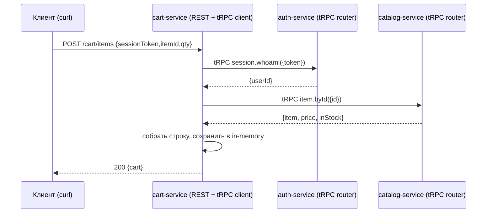

# feat: Учебный проект tRPC + NestJS «монолит → монорепо»

## Problem Frame

Учебный репозиторий, показывающий один домен (Auth / Catalog / Cart) дважды: как монолит NestJS с межмодульными вызовами через DI и как монорепо из трёх сервисов NestJS, общающихся по tRPC. Главный обучающий приём — паритет места вызова: `catalogService.byId(id)` (DI, один процесс) превращается в `catalog.item.byId.query({ id })` (tRPC-клиент по HTTP) при неизменной форме вызова; меняется только транспорт. Документация — главный продукт: пошаговый разбор трансформации + честные best practices.

Источник требований: `docs/brainstorms/2026-06-05-trpc-nestjs-monolith-to-monorepo-requirements.md`.

---

## Approach Summary

- **Два независимых проекта** в корне: `monolith/` (отдельное приложение NestJS) и `monorepo/` (pnpm workspaces). Каждый клонируется и запускается сам по себе. Кросс-проектной общей сборки типов нет — паритет сигнатур держится соглашением и показывается в документации (см. origin: Outstanding Questions Q3).
- **tRPC — ручная обвязка** на `@trpc/server`: роутеры через `initTRPC`, NestJS-сервисы из DI внутри процедур, монтирование через Express-адаптер. Клиенты на `@trpc/client` (`createTRPCClient` + `httpBatchLink`). Роутеры импортируются вызывающей стороной **только как тип** (`import type`) — рантайм-кода чужого сервиса в бандле нет. Решение: ручная обвязка выбрана ради прозрачности механизма (см. Key Technical Decisions).
- **Публичный край — REST, внутренний меш — tRPC.** В обоих проектах Cart выставляет тонкий REST-контроллер как публичный вход (пример в README — обычный `curl`). В монорепо Cart внутри обращается к Auth и Catalog через tRPC-клиенты.
- **Хранение — in-memory** репозитории, засеянные детерминированно при старте. Каждый сервис монорепо владеет своими данными, поэтому Cart физически вынужден ходить по сети.
- **Конфигурация — `@itgorillaz/configify`** (порты, URL соседних сервисов). **TDD** на фиче-юнитах, ESLint + Prettier с самого начала.

**Execution note (весь план):** при работе в `ce-work` обязательно загрузить базовый скилл `/nestjs-builder` (скаффолдинг модулей/сервисов) и `/nestjs-configify` (конфигурация). Prisma не используется (in-memory), скилл `/nestjs-prisma` не нужен. Разработка фиче-юнитов — test-first.

---

## Output Structure

```text
.
├── monolith/                      # самостоятельное приложение NestJS
│   ├── src/
│   │   ├── auth/                  # AuthModule, AuthService, in-memory repo, seed
│   │   ├── catalog/              # CatalogModule, CatalogService, in-memory repo, seed
│   │   ├── cart/                 # CartModule, CartService (DI: Auth+Catalog), CartController (REST)
│   │   ├── config/              # configify-классы (порт приложения)
│   │   ├── app.module.ts
│   │   └── main.ts
│   ├── test/                     # e2e
│   ├── .eslintrc / .prettierrc / tsconfig / jest config
│   └── README.md                 # минимальный + ссылка на монорепо
│
└── monorepo/                      # pnpm workspaces
    ├── pnpm-workspace.yaml
    ├── package.json              # корневые dev-скрипты (dev/build/test/lint)
    ├── tsconfig.base.json
    └── packages/
        ├── shared/               # initTRPC (t), базовый Context, общие доменные типы/Zod-схемы
        ├── auth-service/         # NestJS + tRPC-роутер (whoami), export type AuthRouter
        ├── catalog-service/      # NestJS + tRPC-роутер (item.byId), export type CatalogRouter
        └── cart-service/         # NestJS + tRPC-клиенты (import type Auth/Catalog) + CartController (REST)
```

Дерево — декларация ожидаемой формы вывода, не жёсткое ограничение; авторитетны `**Files:**` в юнитах.

---

## High-Level Technical Design

Иллюстрирует намеченный подход — это направляющий ориентир для ревью, не спецификация реализации. Имплементирующий агент трактует как контекст, а не как код для копирования.

**Параллель «было/стало» (ядро урока):**

```text
МОНОЛИТ (один процесс)                    МОНОРЕПО (tRPC по HTTP)
─────────────────────────                 ──────────────────────────────
CartController.add()                       CartController.add()           // тот же REST-вход
  └─ cartService.add()                       └─ cartService.add()
       ├─ authService.whoami(token)              ├─ authClient.session.whoami.query({ token })
       └─ catalogService.byId(id)                └─ catalogClient.item.byId.query({ id })
            // вызовы через DI                          // те же сигнатуры, но сетевые tRPC-вызовы
```

**Поток F2 (добавление в корзину, монорепо):**



**Граница типобезопасности:** `export type CatalogRouter = typeof appRouter` на сервере; `import type { CatalogRouter }` + `createTRPCClient<CatalogRouter>()` на клиенте. Типы — на компиляции; рантайм — HTTP. Это и есть compile-time coupling, ради которого нужен монорепо.

---

## Requirements Traceability

| Origin | Покрывается юнитами |
|---|---|
| R1 (две папки + README) | U1, U5, U10, U11 |
| R2 (минимальный README монолита + плейсхолдер ссылки) | U10 |
| R3 (подробный README монорепо, пошагово) | U11 |
| R4 (раздел запуска + пример сквозного вызова) | U9, U10, U11 |
| R5–R8 (монолит: 3 модуля, DI, поведение, in-memory) | U2, U3, U4 |
| R9 (pnpm workspaces, 3 сервиса + shared) | U5, U6, U7, U8 |
| R10 (tRPC-роутер на сервис, `import type`) | U6, U7, U8 |
| R11 (Cart — публичный вход, fan-out по tRPC) | U8 |
| R12 (best practices: честный compile-time coupling) | U11 |
| R13 (in-memory как упрощение, Prisma — «на потом») | U11 |
| R14 (паритет сигнатур, отличие только транспорт) | U4, U8, U11 |
| R15 (configify) | U1, U9 |
| R16 (TDD) | U2, U3, U4, U6, U7, U8 (Execution note) |
| R17 (ESLint + Prettier с начала) | U1, U5 |
| AE1 | U4 · AE2 | U8 · AE3 | U8 · AE4 | U10 |

---

## Implementation Units

### Фаза A — Монолит (`monolith/`)

### U1. Скаффолд приложения монолита + тулинг
- **Goal:** рабочий каркас NestJS-приложения с линтером, форматтером, тестами и configify.
- **Requirements:** R1, R5, R15, R17
- **Dependencies:** —
- **Files:** `monolith/package.json`, `monolith/tsconfig.json`, `monolith/.eslintrc.cjs`, `monolith/.prettierrc`, `monolith/jest.config.ts`, `monolith/src/main.ts`, `monolith/src/app.module.ts`, `monolith/src/config/app-config.ts`
- **Approach:** стандартный bootstrap NestJS. Порт приложения — через configify-класс (`@Configuration()` + `@Value()`), значение из `.env` с дефолтом. ESLint + Prettier подключены сразу. `strictPropertyInitialization` отключить в tsconfig (требование configify).
- **Patterns to follow:** конвенции `/nestjs-builder`; конфиг — `/nestjs-configify` (`ConfigifyModule.forRootAsync()`).
- **Test scenarios:** `Test expectation: none -- скаффолд/конфиг`. Допустимо одно smoke-e2e: приложение поднимается, `GET /health` (или корень) отвечает 200.
- **Verification:** `pnpm|npm run start` поднимает приложение; линт и формат проходят без ошибок.

### U2. Модуль Auth (монолит)
- **Goal:** проверка владельца сессии по токену на засеянных данных.
- **Requirements:** R5, R6, R7, R8, R16
- **Dependencies:** U1
- **Files:** `monolith/src/auth/auth.module.ts`, `monolith/src/auth/auth.service.ts`, `monolith/src/auth/session.repository.ts`, `monolith/src/auth/auth.seed.ts`, `monolith/src/auth/auth.types.ts`, `monolith/src/auth/auth.service.spec.ts`
- **Approach:** `SessionRepository` — in-memory `Map<token, userId>` + `Map<userId, User>`, засев при инициализации. `AuthService.whoami(token): { userId } | null`. AuthModule экспортирует AuthService.
- **Execution note:** реализовать поведение test-first.
- **Patterns to follow:** репозиторий как отдельный провайдер; типы домена в `auth.types.ts`.
- **Test scenarios:**
  - Happy: `whoami('s1')` для засеянной сессии → `{ userId: 'u1' }`.
  - Edge: `whoami(<неизвестный токен>)` → `null` (или доменная ошибка — зафиксировать единый контракт).
  - Edge: пустой/`undefined` токен → отказ без падения.
- **Verification:** `auth.service.spec.ts` зелёный; AuthService инжектируется в других модулях.

### U3. Модуль Catalog (монолит)
- **Goal:** получение товара (цена/наличие) по id на засеянных данных.
- **Requirements:** R5, R6, R7, R8, R16
- **Dependencies:** U1
- **Files:** `monolith/src/catalog/catalog.module.ts`, `monolith/src/catalog/catalog.service.ts`, `monolith/src/catalog/item.repository.ts`, `monolith/src/catalog/catalog.seed.ts`, `monolith/src/catalog/catalog.types.ts`, `monolith/src/catalog/catalog.service.spec.ts`
- **Approach:** `ItemRepository` — in-memory `Map<id, Item>` (id, name, price, inStock), засев при инициализации. `CatalogService.byId(id): Item | null`. CatalogModule экспортирует CatalogService.
- **Execution note:** test-first.
- **Patterns to follow:** зеркалит структуру U2 (репозиторий + сервис + seed + types).
- **Test scenarios:**
  - Happy: `byId('i1')` → товар с ценой и `inStock=true`.
  - Edge: `byId(<неизвестный id>)` → `null` (единый контракт с Auth).
  - Edge: товар не в наличии → возвращается с `inStock=false` (решение «можно ли добавить» — на стороне Cart).
- **Verification:** `catalog.service.spec.ts` зелёный.

### U4. Модуль Cart + REST-вход (монолит)
- **Goal:** добавление позиции и получение корзины; Cart дёргает Auth и Catalog через DI; публичный REST-вход.
- **Requirements:** R5, R6, R7, R8, R14, R16 · покрывает AE1
- **Dependencies:** U2, U3
- **Files:** `monolith/src/cart/cart.module.ts`, `monolith/src/cart/cart.service.ts`, `monolith/src/cart/cart.repository.ts`, `monolith/src/cart/cart.controller.ts`, `monolith/src/cart/cart.dto.ts`, `monolith/src/cart/cart.service.spec.ts`, `monolith/test/cart.e2e-spec.ts`
- **Approach:** `CartService.add(token, itemId, qty)` → `authService.whoami(token)` (определить владельца), `catalogService.byId(itemId)` (цена/наличие), собрать строку с ценой из Catalog, сохранить в in-memory корзину пользователя. `CartController` — `POST /cart/items`, `GET /cart` (по токену). **Сигнатуры `whoami`/`byId` зафиксировать осознанно — они должны совпасть с tRPC-процедурами монорепо (R14).**
- **Execution note:** test-first; начать с интеграционного e2e на контракт `POST /cart/items`.
- **Patterns to follow:** валидация DTO (class-validator) на контроллере; CartModule импортирует Auth/CatalogModule.
- **Test scenarios:**
  - `Covers AE1.` Happy (unit + e2e): засеяны сессия `s1→u1` и товар `i1` (цена 100, в наличии); `POST /cart/items {s1,i1,2}` → корзина `u1` содержит `i1×2` с ценой из Catalog; вызовы внутри процесса.
  - Error: неизвестная сессия → 401/доменный отказ, корзина не меняется.
  - Error: неизвестный товар → 404/доменный отказ.
  - Edge: товар не в наличии → отказ добавления (зафиксировать правило).
  - Edge: повторное добавление того же товара → увеличение qty (или новая строка — зафиксировать).
  - Integration: `GET /cart` после добавления возвращает сохранённую строку (доказывает реальную персистентность в репозитории, не мок).
- **Verification:** unit + e2e зелёные; монолит запускается и обслуживает пример из README.

### Фаза B — Монорепо (`monorepo/`)

### U5. Скаффолд pnpm-воркспейса + пакет shared
- **Goal:** каркас монорепо и общий пакет с инициализацией tRPC и доменными типами.
- **Requirements:** R1, R9, R17
- **Dependencies:** —
- **Files:** `monorepo/pnpm-workspace.yaml`, `monorepo/package.json`, `monorepo/tsconfig.base.json`, `monorepo/.eslintrc.cjs`, `monorepo/.prettierrc`, `monorepo/packages/shared/package.json`, `monorepo/packages/shared/src/trpc.ts`, `monorepo/packages/shared/src/context.ts`, `monorepo/packages/shared/src/domain.ts`, `monorepo/packages/shared/src/index.ts`
- **Approach:** `pnpm-workspace.yaml` → `packages/*`. `shared/src/trpc.ts` экспортирует единый `t = initTRPC.context<Context>().create()` (база `router`/`procedure`). `context.ts` — тип Context. `domain.ts` — общие Zod-схемы + выведенные типы (User, Item, входы процедур). Пакеты ссылаются на shared через `workspace:*`. ESLint/Prettier на уровне корня.
- **Patterns to follow:** type-only барьер начинается уже здесь — shared не тянет код сервисов.
- **Test scenarios:** `Test expectation: none -- скаффолд/общие типы`. Опционально: тест, что Zod-схемы домена парсят валидный и отвергают невалидный вход.
- **Verification:** `pnpm install` связывает воркспейс; `shared` собирается; импортируется из пакета-заглушки.

### U6. Сервис Auth (tRPC-роутер)
- **Goal:** auth-service как NestJS-приложение с tRPC-роутером `session.whoami`, экспорт типа роутера.
- **Requirements:** R9, R10, R16
- **Dependencies:** U5
- **Files:** `monorepo/packages/auth-service/package.json`, `.../src/main.ts`, `.../src/app.module.ts`, `.../src/auth/auth.service.ts`, `.../src/auth/session.repository.ts`, `.../src/auth/auth.seed.ts`, `.../src/trpc/auth.router.ts`, `.../src/trpc/trpc.context.ts`, `.../src/router.ts` (export type AuthRouter), `.../src/auth/auth.service.spec.ts`, `.../src/trpc/auth.router.spec.ts`
- **Approach:** доменная логика AuthService/Repository — перенос из U2 (тот же контракт `whoami`). `auth.router.ts`: `t.router({ session: t.router({ whoami: t.procedure.input(z...).query(({input}) => authService.whoami(input.token)) }) })`. Роутер-фабрика получает AuthService из DI-контейнера Nest. `main.ts` монтирует роутер через `@trpc/server/adapters/express` на пути (напр. `/trpc`). `export type AuthRouter = typeof appRouter`.
- **Execution note:** test-first для процедуры (вход/выход/ошибка).
- **Patterns to follow:** роутер тонкий — только адаптация вход/выход, бизнес-логика в сервисе (как в discussion #1504).
- **Test scenarios:**
  - Happy: процедура `session.whoami` с засеянным токеном → `{ userId }`.
  - Error: неизвестный токен → согласованный tRPC-ответ (та же семантика, что в монолите U2).
  - Edge: невалидный вход (пустой токен) → ошибка валидации Zod до бизнес-логики.
- **Verification:** сервис стартует, `/trpc` отвечает; specs зелёные; тип AuthRouter экспортируется.

### U7. Сервис Catalog (tRPC-роутер)
- **Goal:** catalog-service с tRPC-роутером `item.byId`, экспорт типа роутера.
- **Requirements:** R9, R10, R16
- **Dependencies:** U5
- **Files:** `monorepo/packages/catalog-service/package.json`, `.../src/main.ts`, `.../src/app.module.ts`, `.../src/catalog/catalog.service.ts`, `.../src/catalog/item.repository.ts`, `.../src/catalog/catalog.seed.ts`, `.../src/trpc/catalog.router.ts`, `.../src/trpc/trpc.context.ts`, `.../src/router.ts` (export type CatalogRouter), `.../src/catalog/catalog.service.spec.ts`, `.../src/trpc/catalog.router.spec.ts`
- **Approach:** зеркалит U6. `item.byId` процедура → `catalogService.byId(input.id)`. Монтирование `/trpc` через Express-адаптер. `export type CatalogRouter = typeof appRouter`. Контракт `byId` совпадает с монолитом U3.
- **Execution note:** test-first.
- **Patterns to follow:** идентичная структура с auth-service для наглядности.
- **Test scenarios:**
  - Happy: `item.byId('i1')` → товар с ценой/наличием.
  - Error: неизвестный id → согласованный ответ.
  - Edge: невалидный вход → ошибка валидации Zod.
- **Verification:** сервис стартует; specs зелёные; тип CatalogRouter экспортируется.

### U8. Сервис Cart (tRPC-клиенты + REST-вход)
- **Goal:** cart-service — публичный REST-вход, внутри fan-out к Auth и Catalog через tRPC-клиенты; типобезопасность через `import type`.
- **Requirements:** R9, R10, R11, R14, R16 · покрывает AE2, AE3
- **Dependencies:** U6, U7
- **Files:** `monorepo/packages/cart-service/package.json`, `.../src/main.ts`, `.../src/app.module.ts`, `.../src/cart/cart.service.ts`, `.../src/cart/cart.repository.ts`, `.../src/cart/cart.controller.ts`, `.../src/cart/cart.dto.ts`, `.../src/clients/auth.client.ts`, `.../src/clients/catalog.client.ts`, `.../src/config/services-config.ts`, `.../src/cart/cart.service.spec.ts`, `.../test/cart.e2e-spec.ts`
- **Approach:** клиенты строятся через `createTRPCClient<AuthRouter>({ links:[httpBatchLink({ url: cfg.authUrl })] })`, где `AuthRouter`/`CatalogRouter` импортированы **только как тип** из соседних пакетов (`import type { AuthRouter } from '@app/auth-service'`). URL соседей — из configify (`services-config.ts`). `CartService.add` повторяет логику монолита U4, но `whoami`/`byId` — сетевые tRPC-вызовы. `CartController` — `POST /cart/items`, `GET /cart`.
- **Execution note:** test-first; ключевой e2e — поднять (или замокать на границе HTTP) Auth/Catalog и доказать реальный сетевой вызов.
- **Patterns to follow:** `import type` обязателен (иначе рантайм-связывание); клиенты — отдельные провайдеры Nest.
- **Test scenarios:**
  - `Covers AE2.` Integration e2e: при поднятых auth/catalog `POST /cart/items {s1,i1,2}` даёт тот же результат, что AE1 монолита; Cart выполнил tRPC-вызовы к обоим сервисам; сигнатуры совпали с монолитом.
  - `Covers AE3.` Type/build-тест: сборка cart-service не включает рантайм-код auth/catalog (импорт только типов) — проверяется компиляцией и/или анализом бандла.
  - Error: auth-service недоступен/таймаут → Cart отвечает понятной ошибкой, не падает.
  - Error: неизвестная сессия (Auth вернул отказ) → корзина не меняется.
  - Error: неизвестный товар (Catalog вернул отказ) → отказ добавления.
  - Integration: `GET /cart` после добавления возвращает сохранённую строку.
- **Verification:** три сервиса вместе обслуживают сквозной поток F2; specs зелёные.

### U9. Оркестрация воркспейса + конфиг + пример вызова
- **Goal:** запустить все три сервиса одной командой, развести порты/URL через конфиг, дать готовый пример сквозного вызова.
- **Requirements:** R4, R9, R15
- **Dependencies:** U6, U7, U8
- **Files:** `monorepo/package.json` (скрипты `dev`/`build`/`test`/`lint`), `monorepo/.env.example`, `monorepo/scripts/demo-call.sh` (или `.http`), `monorepo/packages/*/.env.example`
- **Approach:** корневой `dev` поднимает три сервиса параллельно (напр. через `pnpm -r --parallel run start:dev` или `concurrently`). Порты и `AUTH_SERVICE_URL`/`CATALOG_SERVICE_URL` — через configify, дефолты в `.env.example`. `demo-call.sh` — `curl` к `POST /cart/items` cart-сервиса.
- **Patterns to follow:** конфиг каждого сервиса — отдельный configify-класс; никакого хардкода портов.
- **Test scenarios:** `Test expectation: none -- оркестрация/скрипты`. Ручная проверка: `dev` поднимает 3 сервиса, `demo-call.sh` возвращает корзину.
- **Verification:** с чистого клона `pnpm install` → `pnpm dev` → `demo-call.sh` отрабатывает сквозной поток.

### Фаза C — Документация

### U10. README монолита
- **Goal:** минимальный README: назначение + ссылка на монорепо (плейсхолдер до публикации) + как запустить.
- **Requirements:** R1, R2, R4 · покрывает AE4
- **Dependencies:** U4
- **Files:** `monolith/README.md`
- **Approach:** коротко: что это и зачем; раздел «запуск»; пример вызова `curl`; явный плейсхолдер ссылки на монорепо, помеченный «обновить после публикации на GitHub».
- **Test scenarios:** `Test expectation: none -- документация`.
  - `Covers AE4.` Ручная проверка: README содержит назначение и явный помеченный плейсхолдер ссылки.
- **Verification:** инструкции запускают монолит у читателя с нуля.

### U11. README монорепо: пошаговый разбор + best practices
- **Goal:** подробная документация — как монолит разделён на 3 сервиса по tRPC, пошагово, + честные best practices.
- **Requirements:** R1, R3, R4, R12, R13, R14
- **Dependencies:** U8, U9
- **Files:** `monorepo/README.md` (при необходимости `monorepo/docs/step-by-step.md`)
- **Approach:** разделы — (1) обзор и запуск; (2) пошаговая трансформация модуль→сервис на примере Catalog (роутер → `typeof` → `export type` → `import type` → клиент); (3) параллель «было/стало» диффом (R14); (4) best practices: `import type` развязывает рантайм; общие типы = **compile-time coupling** — уместно в монорепо, **неуместно** для полиглот/независимо деплоящихся сервисов (там gRPC/контракты); тонкие роутеры, бизнес-логика в сервисах; публичный REST-край + внутренний tRPC-меш; (5) «куда расти дальше»: in-memory → Prisma (R13), ручная обвязка → `nestjs-trpc`, синхронный tRPC → события/очереди.
- **Test scenarios:** `Test expectation: none -- документация`. Ручная проверка: пошаговые шаги воспроизводимы; раздел best practices содержит оговорку про compile-time coupling и упоминание Prisma как следующего шага.
- **Verification:** читатель, пройдя README, запускает монорепо и понимает механизм и его границы применимости.

---

## Key Technical Decisions

- **Ручная обвязка tRPC, а не `nestjs-trpc`.** Цель репозитория — показать механизм; ручной подход держит три звена (роутер → `export type` → `import type`/клиент) на виду как обычный TypeScript, тогда как декораторная библиотека прячет контракт за кодогеном и «оболочкой». `nestjs-trpc` уходит в «куда расти дальше». (см. origin Q-tRPC; решение пользователя.)
- **Публичный REST-край, внутренний tRPC-меш.** REST-вход Cart делает пример в README обычным `curl` и попутно учит реалистичному паттерну. (см. origin Outstanding Questions Q1.)
- **Два независимых проекта без общей кросс-проектной типовой сборки.** Паритет сигнатур (R14) — соглашением + диффом в документации, а не машинерией. Сохраняет «клонировал и запустил» для каждого проекта по отдельности. (см. origin Q3.)
- **Shared-пакет = единый `initTRPC` + Context + доменные Zod-схемы.** Сервисы владеют своими роутерами и экспортируют их типы. (см. origin Q2.)
- **In-memory хранение.** Ноль настройки, фокус на tRPC; изоляция данных по сервисам естественно вынуждает сетевые вызовы. Prisma — задокументированное упражнение.
- **configify, а не `@nestjs/config`** — по правилам проекта; естественно ложится на порты и URL соседей.

---

## Alternative Approaches Considered

- **`nestjs-trpc` декораторная библиотека.** Меньше бойлерплейта, DI из коробки, ближе к стилю NestJS. Отклонено для активного плана: прячет механизм tRPC за кодогеном/оболочкой и размывает параллель «было/стало» — антипод учебной цели. Оставлено как продакшен-альтернатива в README.
- **Nx / Turborepo как инструмент монорепо.** Мощнее, но добавляют абстракции поверх урока. Отклонено в брейншторме в пользу pnpm workspaces (прозрачность).
- **tRPC как публичный край (без REST).** Единообразно, но пример вызова в README становится неудобным (формат tRPC-HTTP), теряется простой `curl`. Отклонено.
- **Нативный транспорт микросервисов NestJS (TCP/gRPC/NATS).** Это «правильный» продакшен-путь для независимо деплоящихся сервисов, но он не про tRPC и не даёт параллели «тот же вызов, другой транспорт» через общие TS-типы. Вне темы проекта; упоминается в best practices как граница применимости.

---

## Risk Analysis & Mitigation

- **Дрейф сигнатур монолит↔монорепо (R14).** Риск: `whoami`/`byId` разойдутся, и параллель «было/стало» сломается. Митигация: зафиксировать контракты в U4 осознанно; в U6/U7 переносить тот же контракт; в U11 показать диффом; держать единую семантику «не найдено» во всех юнитах.
- **Случайное рантайм-связывание сервисов.** Риск: импорт роутера значением (без `type`) втянет код соседа в бандл и убьёт развязку. Митигация: `import type` обязателен (U8); type/build-тест AE3 ловит регресс.
- **DI внутри tRPC-роутеров.** Риск: фабрика роутера не получит NestJS-сервис. Митигация: строить роутер после инициализации DI-контейнера, получая провайдеры из приложения Nest (паттерн discussion #1504).
- **Версии tRPC v11 / NestJS / TS.** Риск: рассинхрон API адаптеров. Митигация: зафиксировать совместимые версии при скаффолде (U5); проверить standalone/express-адаптер на старте.
- **Хрупкость e2e для сетевого пути (U8).** Риск: флай-тесты из-за реального HTTP. Митигация: поднимать соседей детерминированно в setup либо мокать строго на HTTP-границе, сохраняя проверку реального сетевого вызова.

---

## Scope Boundaries

Перенесено из origin (см. requirements). В реализацию не входит:
- Настоящая авторизация (JWT/Passport/OAuth, пароли) — только засеянные сессии.
- Реальная БД/ORM (Prisma) — только in-memory; Prisma документируется как следующий шаг.
- Фронтенд/UI — проект только бэкенд.
- Деплой, Docker, Kubernetes, service discovery, балансировка, отдельный gateway-сервис.
- Асинхронные брокеры (очереди/события) — межсервисные вызовы синхронные по tRPC.
- Завершение покупки/оплата — Cart останавливается на add/get.
- Nx/Turborepo — выбран pnpm workspaces.

### Deferred to Follow-Up Work
- Документируемые упражнения «куда расти дальше» (Prisma вместо in-memory; `nestjs-trpc`; события вместо синхронного tRPC) — описываются в U11, но не реализуются.
- Обновление реальной ссылки монолит→монорепо после публикации на GitHub (R2) — постфактум, вне кода.

---

## Dependencies / Assumptions

- NestJS как базовый фреймворк; в `ce-work` загрузить `/nestjs-builder` и `/nestjs-configify`.
- tRPC v11 поверх HTTP; единый язык TypeScript во всех сервисах (основа типобезопасности).
- Менеджер пакетов — pnpm (нужно для `workspace:*` и параллельного запуска).
- Сессии/каталог засеяны детерминированно для воспроизводимости примеров README.
- Порядок сборки: shared → сервисы (тип-зависимости).

---

## Deferred to Implementation

- Точные имена методов/провайдеров, финальные Zod-схемы и формы DTO.
- Конкретный механизм параллельного запуска (`pnpm -r --parallel` vs `concurrently`) — выбрать при скаффолде U9.
- Способ e2e для сетевого пути U8 (реальные соседи в setup vs мок на HTTP-границе) — решить, увидев поведение тестов.
- Единый контракт «не найдено» (null vs доменная ошибка vs HTTP-код) — зафиксировать в U2 и протянуть всюду.
- Путь монтирования tRPC (`/trpc`) и форма REST-роутов Cart — уточнить при реализации контроллеров.

---

## Success Criteria

- С чистого клона запускаются и монолит, и монорепо по README; пример вызова к Cart даёт одинаковое поведение.
- В коде видно: место вызова не изменилось по форме — изменился транспорт; читатель понимает, почему типобезопасность держится (общие типы) и какой ценой (compile-time coupling).
- `ce-work` может реализовать план, не изобретая домен, границы сервисов, вход или критерии «готово».
- Раздел best practices даёт критерий «когда tRPC между сервисами уместен, а когда нет».
